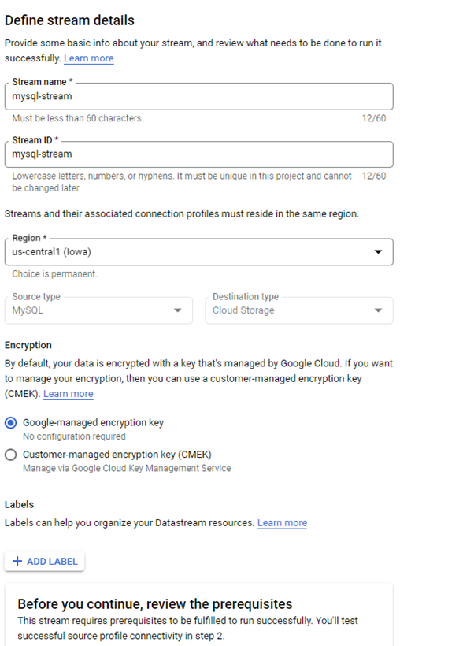
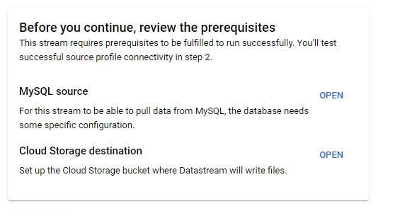

# Apache Hudi vs Delta Lake Showcase

In recent years, ACID compliant data lakes have gained popularity. This transactionality capability is managed by storage layers called Metadata and Governance Layers, two of the most popular competitors are Databricks Delta Lake and Uber’s Hudi.

Both Hudi and Delta work with data abstractions based on *parquet* file format, but each handle transactionality in different ways and provide different features for data lakes. Both tools will be showcased in a basic example to understand their functionality under the hood.

## Environmnet Setup

The infrastructure in which the demo will take place is depicted below.


**Source Database**: Cloud SQL MySQL  
**Change Data Capture Tool**: GCP Datastream  
**Hudi Setup**: Dataproc Cluster Image 2.0.53-debian10  
**Delta Setup**: Databricks Runtime 9.1  
**Object/File Storage**: GCP Cloud Storage


## Data Preparation  
### 1. Bucket Creation

The first bucket will store the information streamed by the CDC Tool

```bash
gcloud storage buckets create gs://dalas-data-bucket
```

The second bucket will store the hudi tables
```bash
gcloud storage buckets create gs://data-lake-cdc
```

### 2. Cloud SQL Instance - MySQL

The command shown below was used to create the MySQL instance, taking into account the configurations needed to make it work alongside Datastream.


```bash
MYSQL_INSTANCE=mysql-db
DATASTREAM_IPS=34.72.28.29,34.67.234.134,34.67.6.157,34.72.239.218,34.71.242.81
gcloud sql instances create ${MYSQL_INSTANCE} \
--cpu=2 --memory=10GB \
--authorized-networks=${DATASTREAM_IPS} \
--enable-bin-log \
--region=us-central1 \
--database-version=MYSQL_8_0 \
--root-password password123
```

Some key points to keep in mind to being able to connect MySQL with Datastream are:
* Make sure that binary logging is enabled on your cloudSQL, if not, the instance can be patched with the following command:

```bash
gcloud sql instances patch <instance name> --enable-bin-log
```
* Set a list of authorized networks to allow connectivity for Datastream 


### MySQL Instance Data Load

After connecting to the instance through the cloud shell, a new database called *demo* is created to store the tables with data. Also a simple table called hudi_delta_test is created with the following schema, using commands below.

```sql
CREATE DATABASE demo;
USE demo;

CREATE TABLE hudi_delta_test
(
pk_id integer,
name varchar(255),
value integer,
updated_at timestamp default now() on update now(),
created_at timestamp default now(),
constraint pk primary key(pk_id)
);
```

Initial demo data is loaded with the following commands.

```sql
insert into hudi_delta_test(pk_id,name,value) values(1,'apple',10);
insert into hudi_delta_test(pk_id,name,value) values(2,'samsung',20);
insert into hudi_delta_test(pk_id,name,value) values(3,'dell',30);
insert into hudi_delta_test(pk_id,name,value) values(4,'motorola',40);
```

For Datastream to connect properly, is neccesary to add a datastream user to MySQL instance, this is done with the following SQL commands.
```sql
CREATE USER 'datastream'@'%' IDENTIFIED BY 'data';
GRANT REPLICATION SLAVE, SELECT, RELOAD, REPLICATION CLIENT, LOCK TABLES, EXECUTE ON *.* TO 'datastream'@'%';
FLUSH PRIVILEGES;
```


### 3. Datastream  

First, it is needed to provide permissions to Datastream service account to read and create objects on the destination bucket. The email address of the service account will be **service-[project_number]@gcp-sa-datastream.iam.gserviceaccount.com**

Select the destination bucket and assign the following permissions to it:
```
roles/storage.objectViewer 
roles/storage.objectCreator
roles/storage.legacyBucketReader
```

Now the stream creation process can begin. First, the Stream name and ID are set, as well as the region, Source type (MySQL), and Destination type (Cloud Storage).




Before continuing, prerequisites are checked as provided in the documentation attached in the same window. This prerequisites were set in place already by previous steps, but always check them in case something has changed overtime.



Next, the MySQL connection profile is defined. The following details are needed:
* Connection name and Connection ID
* Hostname or IP of the cloudSQL or MySQL
* Username and Password for the Datastream user created


Next for the connectivity, you can use various connectivity method such as

    Private connectivity (VPC Peering)
    IP Whitelisting
    Proxy tunneling

For this demo, IP Whitelisting was chosen.

Once the connectivity is established, the connection connection can be tested to ensure the connection doesn't have any blockers.


To configure the Source, we get to choose which tables and schemas are to be included for the datastream to consider for the CDC. For this demo, the whole database created in MySQL (*demo*) and it's future tables are chosen.


Define Destination step. In this step, the destination bucket name is selected and any spefic Path prefix to store the output files can be specified too.


Datastream allows to store the change data in two formats: avro or json. For this demo, avro is the format chosen.


In the final step, we can run validations, to validate the configuration and then click create and start to have the stream get started straight away.


Now  Datastream will stream changes from the MySQL instance hosted on CloudSQL into the GCS bucket. When first connected, Datastream will do a backfill dump which will save a complete snapshot of the tables being traced into the bucket.

In the bucket, the backfill will look like this

Notice that its filename contains the word "backfill-fulldump" and the file format matches the one selected earlier, which is "avro".


The glimpse of the data when opened with Spark is shown below.


To understand the metadata added by Datastream, refer to https://cloud.google.com/datastream/docs/events-and-streams#events. However, notice how the field *payload* stored the entire rows of MySQL data, the exact same data entered by the SQL Insert commands. The nature of the record is reflected in the *source_metadata*, the last but one inner field reads as "INSERT". Also, the *read_method* field indicates that this data was created as part of the backfill-fulldump process.


### 4. Data changes

Changes are introduced into MySQL database in order to have change data streamed into GCS and later work with it with Hudi and Delta.

The changes are issued by connecting again to MySQL cloud shell, and running the SQL command below.

```sql
insert into hudi_delta_test(pk_id,name,value) values(4,'motorola',40);
update hudi_delta_test set value = 201 where pk_id=2;
delete from hudi_delta_test where pk_id=3;
```

On the GCS Bucket, a new file is added almost inmediatly after the issued sql commands. This new file contains "cdc-binlog" in its name and it's avro format as well as with the backfill file.


The glimpse of the data with spark show how the source_metadata changes when concerning updates and delete operations.


## Cluster Setup

Before creating the cluster, you is need to create a auxiliary script file that will tell GCP what packages to load in the cluster machines in the creation step. To work with hudi alongside spark, compatible versions of each package need to be chosen. As of January 2023, Dataproc Image 2.0.53-debian10 comes with Spark 3.1.3, and the following dependencies specified in the bash script work well with such version.


Packages install file

```bash
get  -P /usr/lib/delta/jars/ "https://repo1.maven.org/maven2/org/apache/spark/spark-avro_2.12/3.1.3/spark-avro_2.12-3.1.3.jar"

wget  -P /usr/lib/delta/jars/ "https://repo1.maven.org/maven2/org/apache/hudi/hudi-spark3-bundle_2.12/0.12.2/hudi-spark3-bundle_2.12-0.12.2.jar"
```

Create this script file and locate it in a bucket to use it later with the Dataproc configuration step.

For any other spark versions, refer to this compatibility documentation.  
* https://hudi.apache.org/docs/quick-start-guide/
* https://docs.delta.io/latest/releases.html
* https://docs.databricks.com/delta/index.html


## Cluster creation

The following cloud shell command was used in the cluster creation process. Some key configurations to keep in mind are:

* Component Gateway must be enabled to work with Jupyter Notebooks in Dataproc
* In optional components, ensure to select Jupyter
* For Initialization Actions, you must specify the path to the shell script that will allow GCP to provide the cluster machines with the required auxiliary packages (jars)


```bash
gcloud dataproc clusters create cluster-c9cc \
--enable-component-gateway \
--region us-central1 \
--zone us-central1-c \
--master-machine-type n1-standard-2 \
--master-boot-disk-size 30 \
--num-workers 2 \
--worker-machine-type n1-standard-2 \
--worker-boot-disk-size 30 \
--image-version 2.0-debian10 \
--optional-components HIVE_WEBHCAT,JUPYTER \
--initialization-actions 'gs://data-lake-cdc/packages-install.sh' \
--project dalas-gcp-data-eng
```


# Using Apache Hudi

The entire code for this and the proceeding section can be found in [scala-cdc-hudi.ipynb](/Notebooks/scala-cdc-hudi.ipynb)

Hudi handles upserts in two storage types:

* **Copy on Write**: There is one source of truth, that both readers and writers of the table interact with. Every write is immediately written as an update to the Apache Hudi table, and the updates are reflected in near real time to the readers. The data is stored in a columnar format optimized for reads, such as Apache Parquet.

* **Merge on Read**: Every write is written into a buffered zone in a write optimized data format (row based data format such as Avro), and these are later updated to the table that serves the readers, where data is stored in a columnar format (such as Apache Parquet).

## Using Copy on Write

```scala
val hudiTableName = "hudi_cow"
val hudiTablePath = "gs://data-lake-cdc/data/hudi_cow"

val fullDF = spark.read.format("avro").load(full_load)

// payload field exploded to facilitate analysis
val explodedFullDF = fullDF.select("payload.*", "*")

// Converting timestamp to unix timestamp (long type)
val explodedTsFullDF = explodedFullDF
                            .withColumn("updated_at", unix_timestamp(col("updated_at"), "MM-dd-yyyy HH:mm:ss"))
                            .withColumn("created_at", unix_timestamp(col("created_at"), "MM-dd-yyyy HH:mm:ss"))
                            .withColumn("read_timestamp", unix_timestamp(col("read_timestamp"), "MM-dd-yyyy HH:mm:ss"))
                            .withColumn("source_timestamp", unix_timestamp(col("source_timestamp"), "MM-dd-yyyy HH:mm:ss"))

explodedTsFullDF.write.format("hudi")
    .option(RECORDKEY_FIELD_OPT_KEY, "pk_id")
    .option(PARTITIONPATH_FIELD_OPT_KEY, "created_at")
    .option(TABLE_NAME, hudiTableName)
    .option(OPERATION_OPT_KEY, INSERT_OPERATION_OPT_VAL)
    .option(STORAGE_TYPE_OPT_KEY, "COPY_ON_WRITE")
    .option(PRECOMBINE_FIELD_OPT_KEY, "updated_at")
    .option(HIVE_SYNC_ENABLED_OPT_KEY, "true")
    .option(HIVE_TABLE_OPT_KEY, hudiTableName)
    .option(HIVE_PARTITION_FIELDS_OPT_KEY, "created_at")
    .option(HIVE_ASSUME_DATE_PARTITION_OPT_KEY, "false")
    .option("hoodie.datasource.hive_sync.support_timestamp", "true")
    .option(HIVE_PARTITION_EXTRACTOR_CLASS_OPT_KEY, classOf[MultiPartKeysValueExtractor].getName)
    .mode(Overwrite)
    .save(hudiTablePath)

```

A table named “hudi_cow” will be created in Hive as we have used Hive Auto Sync configurations in the Hudi Options. The Table is created with Parquet SerDe with Hoodie Format.

```bash
hive> show create table hudi_cow;
OK
CREATE EXTERNAL TABLE `hudi_cow`(
  `_hoodie_commit_time` string, 
  `_hoodie_commit_seqno` string, 
  `_hoodie_record_key` string, 
  `_hoodie_partition_path` string, 
  `_hoodie_file_name` string, 
  `pk_id` int, 
  `name` string, 
  `value` int, 
  `updated_at` bigint, 
  `uuid` string, 
  `read_timestamp` bigint, 
  `source_timestamp` bigint, 
  `object` string, 
  `read_method` string, 
  `stream_name` string, 
  `schema_key` string, 
  `sort_keys` array<struct<member0:string,member1:bigint>>, 
  `source_metadata` struct<table:string,database:string,primary_keys:array<string>,log_file:string,log_position:bigint,change_type:string,is_deleted:boolean>, 
  `payload` struct<pk_id:int,name:string,value:int,updated_at:timestamp,created_at:timestamp>)
PARTITIONED BY ( 
  `created_at` bigint)
ROW FORMAT SERDE 
  'org.apache.hadoop.hive.ql.io.parquet.serde.ParquetHiveSerDe' 
WITH SERDEPROPERTIES ( 
  'hoodie.query.as.ro.table'='false', 
  'path'='gs://data-lake-cdc/data/hudi_cow') 
STORED AS INPUTFORMAT 
  'org.apache.hudi.hadoop.HoodieParquetInputFormat' 
OUTPUTFORMAT 
  'org.apache.hadoop.hive.ql.io.parquet.MapredParquetOutputFormat'
LOCATION
  'gs://data-lake-cdc/data/hudi_cow'
TBLPROPERTIES (
  'bucketing_version'='2', 
  'last_commit_time_sync'='20230124044607900', 
  'spark.sql.create.version'='3.1.3', 
  'spark.sql.sources.provider'='hudi', 
  'spark.sql.sources.schema.numPartCols'='1', 
  'spark.sql.sources.schema.numParts'='1', 
  'spark.sql.sources.schema.part.0'='{"type":"struct","fields":[{"name":"_hoodie_commit_time","type":"string","nullable":true,"metadata":{}},{"name":"_hoodie_commit_seqno","type":"string","nullable":true,"metadata":{}},{"name":"_hoodie_record_key","type":"string","nullable":true,"metadata":{}},{"name":"_hoodie_partition_path","type":"string","nullable":true,"metadata":{}},{"name":"_hoodie_file_name","type":"string","nullable":true,"metadata":{}},{"name":"pk_id","type":"integer","nullable":true,"metadata":{}},{"name":"name","type":"string","nullable":true,"metadata":{}},{"name":"value","type":"integer","nullable":true,"metadata":{}},{"name":"updated_at","type":"long","nullable":true,"metadata":{}},{"name":"uuid","type":"string","nullable":true,"metadata":{}},{"name":"read_timestamp","type":"long","nullable":true,"metadata":{}},{"name":"source_timestamp","type":"long","nullable":true,"metadata":{}},{"name":"object","type":"string","nullable":true,"metadata":{}},{"name":"read_method","type":"string","nullable":true,"metadata":{}},{"name":"stream_name","type":"string","nullable":true,"metadata":{}},{"name":"schema_key","type":"string","nullable":true,"metadata":{}},{"name":"sort_keys","type":{"type":"array", "elementType":{"type":"struct","fields":[{"name":"member0","type":"string","nullable":true,"metadata":{}},{"name":"member1","type":"long","nullable":true,"metadata":{}}]},"containsNull":false},"nullable":true,"metadata":{}},{"name":"source_metadata","type":{"type":"struct","fields":[{"name":"table","type":"string","nullable":true,"metadata":{}},{"name":"database","type":"string","nullable":true,"metadata":{}},{"name":"primary_keys","type":{"type":"array", "elementType":"string","containsNull":false},"nullable":true,"metadata":{}},{"name":"log_file","type":"string","nullable":true,"metadata":{}},{"name":"log_position","type":"long","nullable":true,"metadata":{}},{"name":"change_type","type":"string","nullable":true,"metadata":{}},{"name":"is_deleted","type":"boolean","nullable":true,"metadata":{}}]},"nullable":true,"metadata":{}},{"name":"payload","type":{"type":"struct","fields":[{"name":"pk_id","type":"integer","nullable":true,"metadata":{}},{"name":"name","type":"string","nullable":true,"metadata":{}},{"name":"value","type":"integer","nullable":true,"metadata":{}},{"name":"updated_at","type":"timestamp","nullable":true,"metadata":{}},{"name":"created_at","type":"timestamp","nullable":true,"metadata":{}}]},"nullable":true,"metadata":{}},{"name":"created_at","type":"long","nullable":true,"metadata":{}}]}', 
  'spark.sql.sources.schema.partCol.0'='created_at', 
  'transient_lastDdlTime'='1674535479')
Time taken: 0.904 seconds, Fetched: 43 row(s)
```

The contents of the table are displayed below.

```scala
spark.sql("select * from hudi_cow").show(numRows=10, truncate=0, vertical=true)
```
```bash
-RECORD 0------------------------------------------------------------------------------------------
 _hoodie_commit_time    | 20230125230056332                                                        
 _hoodie_commit_seqno   | 20230125230056332_0_0                                                    
 _hoodie_record_key     | 1                                                                        
 _hoodie_partition_path | 1673496078                                                               
 _hoodie_file_name      | aac67161-882d-46b8-95a2-de524064cdc0-0_0-37-31_20230125230056332.parquet 
 pk_id                  | 1                                                                        
 name                   | apple                                                                    
 value                  | 10                                                                       
 updated_at             | 1673496078                                                               
 uuid                   | 4f3563ca-0213-4df7-9f66-428200000000                                     
 read_timestamp         | 1673496285                                                               
 source_timestamp       | 1673496285                                                               
 object                 | demo_hudi_delta_test                                                     
 read_method            | mysql-backfill-fulldump                                                  
 stream_name            | projects/293162740476/locations/us-central1/streams/mysql-stream         
 schema_key             | 8c0972982087b235becf90b60a52554e7f3774ff                                 
 sort_keys              | [{null, 1673496285000}, {, null}, {null, 0}]                             
 source_metadata        | {hudi_delta_test, demo, [pk_id], , 0, INSERT, false}                     
 payload                | {1, apple, 10, 2023-01-12 04:01:18, 2023-01-12 04:01:18}                 
 created_at             | 1673496078                                                               
-RECORD 1------------------------------------------------------------------------------------------
 _hoodie_commit_time    | 20230125230056332                                                        
 _hoodie_commit_seqno   | 20230125230056332_0_1                                                    
 _hoodie_record_key     | 2                                                                        
 _hoodie_partition_path | 1673496078                                                               
 _hoodie_file_name      | aac67161-882d-46b8-95a2-de524064cdc0-0_0-37-31_20230125230056332.parquet 
 pk_id                  | 2                                                                        
 name                   | samsung                                                                  
 value                  | 20                                                                       
 updated_at             | 1673496078                                                               
 uuid                   | 4f3563ca-0213-4df7-9f66-428200000001                                     
 read_timestamp         | 1673496285                                                               
 source_timestamp       | 1673496285                                                               
 object                 | demo_hudi_delta_test                                                     
 read_method            | mysql-backfill-fulldump                                                  
 stream_name            | projects/293162740476/locations/us-central1/streams/mysql-stream         
 schema_key             | 8c0972982087b235becf90b60a52554e7f3774ff                                 
 sort_keys              | [{null, 1673496285000}, {, null}, {null, 0}]                             
 source_metadata        | {hudi_delta_test, demo, [pk_id], , 0, INSERT, false}                     
 payload                | {2, samsung, 20, 2023-01-12 04:01:18, 2023-01-12 04:01:18}               
 created_at             | 1673496078                                                               
-RECORD 2------------------------------------------------------------------------------------------
 _hoodie_commit_time    | 20230125230056332                                                        
 _hoodie_commit_seqno   | 20230125230056332_0_2                                                    
 _hoodie_record_key     | 3                                                                        
 _hoodie_partition_path | 1673496078                                                               
 _hoodie_file_name      | aac67161-882d-46b8-95a2-de524064cdc0-0_0-37-31_20230125230056332.parquet 
 pk_id                  | 3                                                                        
 name                   | dell                                                                     
 value                  | 30                                                                       
 updated_at             | 1673496078                                                               
 uuid                   | 4f3563ca-0213-4df7-9f66-428200000010                                     
 read_timestamp         | 1673496285                                                               
 source_timestamp       | 1673496285                                                               
 object                 | demo_hudi_delta_test                                                     
 read_method            | mysql-backfill-fulldump                                                  
 stream_name            | projects/293162740476/locations/us-central1/streams/mysql-stream         
 schema_key             | 8c0972982087b235becf90b60a52554e7f3774ff                                 
 sort_keys              | [{null, 1673496285000}, {, null}, {null, 0}]                             
 source_metadata        | {hudi_delta_test, demo, [pk_id], , 0, INSERT, false}                     
 payload                | {3, dell, 30, 2023-01-12 04:01:18, 2023-01-12 04:01:18}                  
 created_at             | 1673496078                                                               
-RECORD 3------------------------------------------------------------------------------------------
 _hoodie_commit_time    | 20230125230056332                                                        
 _hoodie_commit_seqno   | 20230125230056332_1_0                                                    
 _hoodie_record_key     | 4                                                                        
 _hoodie_partition_path | 1673496080                                                               
 _hoodie_file_name      | 7bb6e9bd-fd0d-48f7-b76e-0995c3c3e451-0_1-37-32_20230125230056332.parquet 
 pk_id                  | 4                                                                        
 name                   | motorola                                                                 
 value                  | 40                                                                       
 updated_at             | 1673496080                                                               
 uuid                   | 4f3563ca-0213-4df7-9f66-428200000011                                     
 read_timestamp         | 1673496285                                                               
 source_timestamp       | 1673496285                                                               
 object                 | demo_hudi_delta_test                                                     
 read_method            | mysql-backfill-fulldump                                                  
 stream_name            | projects/293162740476/locations/us-central1/streams/mysql-stream         
 schema_key             | 8c0972982087b235becf90b60a52554e7f3774ff                                 
 sort_keys              | [{null, 1673496285000}, {, null}, {null, 0}]                             
 source_metadata        | {hudi_delta_test, demo, [pk_id], , 0, INSERT, false}                     
 payload                | {4, motorola, 40, 2023-01-12 04:01:20, 2023-01-12 04:01:20}              
 created_at             | 1673496080        
```

The changes made by the second sql commands are upserted with the commands below.

```scala
val df_cdc = spark.read.format("avro").load(cdc_load)
val cdcTsDF = df_cdc
                            .select("payload.*", "*")
                            .withColumn("updated_at", unix_timestamp(col("updated_at"), "MM-dd-yyyy HH:mm:ss"))
                            .withColumn("created_at", unix_timestamp(col("created_at"), "MM-dd-yyyy HH:mm:ss"))
                            .withColumn("read_timestamp", unix_timestamp(col("read_timestamp"), "MM-dd-yyyy HH:mm:ss"))
                            .withColumn("source_timestamp", unix_timestamp(col("source_timestamp"), "MM-dd-yyyy HH:mm:ss"))

cdcTsDF.write.format("hudi")
    .option(RECORDKEY_FIELD_OPT_KEY, "pk_id")
    .option(PARTITIONPATH_FIELD_OPT_KEY, "created_at")
    .option(TABLE_NAME, hudiTableName) 
    .option(STORAGE_TYPE_OPT_KEY, "COPY_ON_WRITE")
    .option(PRECOMBINE_FIELD_OPT_KEY, "updated_at")
    .option(HIVE_SYNC_ENABLED_OPT_KEY, "true")
    .option(HIVE_TABLE_OPT_KEY, hudiTableName)
    .option(HIVE_PARTITION_FIELDS_OPT_KEY, "created_at")
    .option(HIVE_ASSUME_DATE_PARTITION_OPT_KEY, "false")
    .option("hoodie.datasource.hive_sync.support_timestamp", "true")
    .option(HIVE_PARTITION_EXTRACTOR_CLASS_OPT_KEY, classOf[MultiPartKeysValueExtractor].getName)
    .option(OPERATION_OPT_KEY,UPSERT_OPERATION_OPT_VAL)
    .mode(Append).save(hudiTablePath)
```

The same hive table “hudi_cow” will be populated with the latest UPSERTED data as in the query below.
```scala
spark.sql("select * from hudi_cow").show(numRows=10, truncate=0, vertical=true)
```
```bash
-RECORD 0----------------------------------------------------------------------------------------------------
 _hoodie_commit_time    | 20230125232733051                                                                  
 _hoodie_commit_seqno   | 20230125232733051_0_0                                                              
 _hoodie_record_key     | 1                                                                                  
 _hoodie_partition_path | 1673496078                                                                         
 _hoodie_file_name      | 919ff8b7-e1fe-41cf-bfc6-a66dbaa7a2ef-0_0-76-75_20230125232826643.parquet           
 pk_id                  | 1                                                                                  
 name                   | apple                                                                              
 value                  | 10                                                                                 
 updated_at             | 1673496078                                                                         
 uuid                   | 4f3563ca-0213-4df7-9f66-428200000000                                               
 read_timestamp         | 1673496285                                                                         
 source_timestamp       | 1673496285                                                                         
 object                 | demo_hudi_delta_test                                                               
 read_method            | mysql-backfill-fulldump                                                            
 stream_name            | projects/293162740476/locations/us-central1/streams/mysql-stream                   
 schema_key             | 8c0972982087b235becf90b60a52554e7f3774ff                                           
 sort_keys              | [{null, 1673496285000}, {, null}, {null, 0}]                                       
 source_metadata        | {hudi_delta_test, demo, [pk_id], , 0, INSERT, false}                               
 payload                | {1, apple, 10, 2023-01-12 04:01:18, 2023-01-12 04:01:18}                           
 created_at             | 1673496078                                                                         
-RECORD 1----------------------------------------------------------------------------------------------------
 _hoodie_commit_time    | 20230125232826643                                                                  
 _hoodie_commit_seqno   | 20230125232826643_0_1                                                              
 _hoodie_record_key     | 2                                                                                  
 _hoodie_partition_path | 1673496078                                                                         
 _hoodie_file_name      | 919ff8b7-e1fe-41cf-bfc6-a66dbaa7a2ef-0_0-76-75_20230125232826643.parquet           
 pk_id                  | 2                                                                                  
 name                   | samsung                                                                            
 value                  | 201                                                                                
 updated_at             | 1673496646                                                                         
 uuid                   | 967b6537-58f0-4e83-839f-e4ad00000001                                               
 read_timestamp         | 1673496655                                                                         
 source_timestamp       | 1673496646                                                                         
 object                 | demo_hudi_delta_test                                                               
 read_method            | mysql-cdc-binlog                                                                   
 stream_name            | projects/293162740476/locations/us-central1/streams/mysql-stream                   
 schema_key             | 8c0972982087b235becf90b60a52554e7f3774ff                                           
 sort_keys              | [{null, 1673496646000}, {mysql-bin.000001, null}, {null, 11882107}]                
 source_metadata        | {hudi_delta_test, demo, [pk_id], mysql-bin.000001, 11882107, UPDATE-INSERT, false} 
 payload                | {2, samsung, 201, 2023-01-12 04:10:46, 2023-01-12 04:01:18}                        
 created_at             | 1673496078                                                                         
-RECORD 2----------------------------------------------------------------------------------------------------
 _hoodie_commit_time    | 20230125232826643                                                                  
 _hoodie_commit_seqno   | 20230125232826643_0_2                                                              
 _hoodie_record_key     | 3                                                                                  
 _hoodie_partition_path | 1673496078                                                                         
 _hoodie_file_name      | 919ff8b7-e1fe-41cf-bfc6-a66dbaa7a2ef-0_0-76-75_20230125232826643.parquet           
 pk_id                  | 3                                                                                  
 name                   | dell                                                                               
 value                  | 30                                                                                 
 updated_at             | 1673496078                                                                         
 uuid                   | 967b6537-58f0-4e83-839f-e4ad00000010                                               
 read_timestamp         | 1673496655                                                                         
 source_timestamp       | 1673496652                                                                         
 object                 | demo_hudi_delta_test                                                               
 read_method            | mysql-cdc-binlog                                                                   
 stream_name            | projects/293162740476/locations/us-central1/streams/mysql-stream                   
 schema_key             | 8c0972982087b235becf90b60a52554e7f3774ff                                           
 sort_keys              | [{null, 1673496652000}, {mysql-bin.000001, null}, {null, 11882737}]                
 source_metadata        | {hudi_delta_test, demo, [pk_id], mysql-bin.000001, 11882737, DELETE, true}         
 payload                | {3, dell, 30, 2023-01-12 04:01:18, 2023-01-12 04:01:18}                            
 created_at             | 1673496078                                                                         
-RECORD 3----------------------------------------------------------------------------------------------------
 _hoodie_commit_time    | 20230125232826643                                                                  
 _hoodie_commit_seqno   | 20230125232826643_1_0                                                              
 _hoodie_record_key     | 5                                                                                  
 _hoodie_partition_path | 1673496638                                                                         
 _hoodie_file_name      | cb0432a7-c19f-4f78-a8c6-aca251bb5ea7-0_1-76-76_20230125232826643.parquet           
 pk_id                  | 5                                                                                  
 name                   | htc                                                                                
 value                  | 50                                                                                 
 updated_at             | 1673496638                                                                         
 uuid                   | 967b6537-58f0-4e83-839f-e4ad00000000                                               
 read_timestamp         | 1673496655                                                                         
 source_timestamp       | 1673496638                                                                         
 object                 | demo_hudi_delta_test                                                               
 read_method            | mysql-cdc-binlog                                                                   
 stream_name            | projects/293162740476/locations/us-central1/streams/mysql-stream                   
 schema_key             | 8c0972982087b235becf90b60a52554e7f3774ff                                           
 sort_keys              | [{null, 1673496638000}, {mysql-bin.000001, null}, {null, 11881438}]                
 source_metadata        | {hudi_delta_test, demo, [pk_id], mysql-bin.000001, 11881438, INSERT, false}        
 payload                | {5, htc, 50, 2023-01-12 04:10:38, 2023-01-12 04:10:38}                             
 created_at             | 1673496638                                                                         
-RECORD 4----------------------------------------------------------------------------------------------------
 _hoodie_commit_time    | 20230125232733051                                                                  
 _hoodie_commit_seqno   | 20230125232733051_1_0                                                              
 _hoodie_record_key     | 4                                                                                  
 _hoodie_partition_path | 1673496080                                                                         
 _hoodie_file_name      | f9d58cc8-c95c-4b57-a6fd-054dd138338c-0_1-37-32_20230125232733051.parquet           
 pk_id                  | 4                                                                                  
 name                   | motorola                                                                           
 value                  | 40                                                                                 
 updated_at             | 1673496080                                                                         
 uuid                   | 4f3563ca-0213-4df7-9f66-428200000011                                               
 read_timestamp         | 1673496285                                                                         
 source_timestamp       | 1673496285                                                                         
 object                 | demo_hudi_delta_test                                                               
 read_method            | mysql-backfill-fulldump                                                            
 stream_name            | projects/293162740476/locations/us-central1/streams/mysql-stream                   
 schema_key             | 8c0972982087b235becf90b60a52554e7f3774ff                                           
 sort_keys              | [{null, 1673496285000}, {, null}, {null, 0}]                                       
 source_metadata        | {hudi_delta_test, demo, [pk_id], , 0, INSERT, false}                               
 payload                | {4, motorola, 40, 2023-01-12 04:01:20, 2023-01-12 04:01:20}                        
 created_at             | 1673496080
```

As stated in the CoW definition, when we write the cdcTsDF in hudi format to the same bucket location, the Upserted data is copied on write and only one table is used for both Snapshot and Incremental Data.

## Using MoR

```scala
val hudiTableNameMor = "hudi_mor"
val hudiTablePathMor = "gs://data-lake-cdc/data/hudi_mor"

val hudiOptions = Map[String,String](
  RECORDKEY_FIELD_OPT_KEY -> "pk_id",
  PARTITIONPATH_FIELD_OPT_KEY -> "created_at",
  TABLE_NAME -> hudiTableNameMor,
  OPERATION_OPT_KEY -> INSERT_OPERATION_OPT_VAL,
  STORAGE_TYPE_OPT_KEY -> "MERGE_ON_READ",
  PRECOMBINE_FIELD_OPT_KEY -> "updated_at",
  HIVE_SYNC_ENABLED_OPT_KEY -> "true",
  HIVE_TABLE_OPT_KEY -> hudiTableNameMor,
  HIVE_PARTITION_FIELDS_OPT_KEY -> "created_at",    
  HIVE_ASSUME_DATE_PARTITION_OPT_KEY -> "false",
  "hoodie.datasource.hive_sync.support_timestamp" -> "true",  
  HIVE_PARTITION_EXTRACTOR_CLASS_OPT_KEY -> classOf[MultiPartKeysValueExtractor].getName
)

explodedTsFullDF.write.format("hudi")
    .options(hudiOptions)
    .mode(Overwrite)
    .save(hudiTablePathMor)
```

Two tables named “hudi_mor” and “hudi_mor_rt” will be created in Hive. hudi_mor is a read optimized table and will have snapshot data while hudi_mor_rt will have incrimental and real-time merged data. The data is compacted and made available to hudi_mor at frequent compact intervals. hudi_mor_rt leverages Avro format to store incrimental data. As the Definition says MoR, the data when read via hudi_mor_rt would be merged on the fly. This is good for high updatable source table, while providing a consistent and not very latest read optimized table.

NOTE: Both “hudi_mor” and “hudi_mor_rt” point to the same GCS bucket but are defined with different Storage Formats.

Hive create commands are shown below.
```sql
hive> show create table hudi_mor_ro;
OK
CREATE EXTERNAL TABLE `hudi_mor_ro`(
  `_hoodie_commit_time` string, 
  `_hoodie_commit_seqno` string, 
  `_hoodie_record_key` string, 
  `_hoodie_partition_path` string, 
  `_hoodie_file_name` string, 
  `pk_id` int, 
  `name` string, 
  `value` int, 
  `updated_at` bigint, 
  `uuid` string, 
  `read_timestamp` bigint, 
  `source_timestamp` bigint, 
  `object` string, 
  `read_method` string, 
  `stream_name` string, 
  `schema_key` string, 
  `sort_keys` array<struct<member0:string,member1:bigint>>, 
  `source_metadata` struct<table:string,database:string,primary_keys:array<string>,log_file:string,log_position:bigint,change_type:string,is_deleted:boolean>, 
  `payload` struct<pk_id:int,name:string,value:int,updated_at:timestamp,created_at:timestamp>)
PARTITIONED BY ( 
  `created_at` bigint)
ROW FORMAT SERDE 
  'org.apache.hadoop.hive.ql.io.parquet.serde.ParquetHiveSerDe' 
WITH SERDEPROPERTIES ( 
  'hoodie.query.as.ro.table'='true', 
  'path'='gs://data-lake-cdc/data/hudi_mor') 
STORED AS INPUTFORMAT 
  'org.apache.hudi.hadoop.HoodieParquetInputFormat' 
OUTPUTFORMAT 
  'org.apache.hadoop.hive.ql.io.parquet.MapredParquetOutputFormat'
LOCATION
  'gs://data-lake-cdc/data/hudi_mor'
TBLPROPERTIES (
  'bucketing_version'='2', 
  'last_commit_time_sync'='20230125232928100', 
  'spark.sql.create.version'='3.1.3', 
  'spark.sql.sources.provider'='hudi', 
  'spark.sql.sources.schema.numPartCols'='1', 
  'spark.sql.sources.schema.numParts'='1', 
  'spark.sql.sources.schema.part.0'='{"type":"struct","fields":[{"name":"_hoodie_commit_time","type":"string","nullable":true,"metadata":{}},{"name":"_hoodie_commit_seqno","type":"string","nullable":true,"metadata":{}},{"name":"_hoodie_record_key","type":"string","nullable":true,"metadata":{}},{"name":"_hoodie_partition_path","type":"string","nullable":true,"metadata":{}},{"name":"_hoodie_file_name","type":"string","nullable":true,"metadata":{}},{"name":"pk_id","type":"integer","nullable":true,"metadata":{}},{"name":"name","type":"string","nullable":true,"metadata":{}},{"name":"value","type":"integer","nullable":true,"metadata":{}},{"name":"updated_at","type":"long","nullable":true,"metadata":{}},{"name":"uuid","type":"string","nullable":true,"metadata":{}},{"name":"read_timestamp","type":"long","nullable":true,"metadata":{}},{"name":"source_timestamp","type":"long","nullable":true,"metadata":{}},{"name":"object","type":"string","nullable":true,"metadata":{}},{"name":"read_method","type":"string","nullable":true,"metadata":{}},{"name":"stream_name","type":"string","nullable":true,"metadata":{}},{"name":"schema_key","type":"string","nullable":true,"metadata":{}},{"name":"sort_keys","type":{"type":"array", "elementType":{"type":"struct","fields":[{"name":"member0","type":"string","nullable":true,"metadata":{}},{"name":"member1","type":"long","nullable":true,"metadata":{}}]},"containsNull":false},"nullable":true,"metadata":{}},{"name":"source_metadata","type":{"type":"struct","fields":[{"name":"table","type":"string","nullable":true,"metadata":{}},{"name":"database","type":"string","nullable":true,"metadata":{}},{"name":"primary_keys","type":{"type":"array", "elementType":"string","containsNull":false},"nullable":true,"metadata":{}},{"name":"log_file","type":"string","nullable":true,"metadata":{}},{"name":"log_position","type":"long","nullable":true,"metadata":{}},{"name":"change_type","type":"string","nullable":true,"metadata":{}},{"name":"is_deleted","type":"boolean","nullable":true,"metadata":{}}]},"nullable":true,"metadata":{}},{"name":"payload","type":{"type":"struct","fields":[{"name":"pk_id","type":"integer","nullable":true,"metadata":{}},{"name":"name","type":"string","nullable":true,"metadata":{}},{"name":"value","type":"integer","nullable":true,"metadata":{}},{"name":"updated_at","type":"timestamp","nullable":true,"metadata":{}},{"name":"created_at","type":"timestamp","nullable":true,"metadata":{}}]},"nullable":true,"metadata":{}},{"name":"created_at","type":"long","nullable":true,"metadata":{}}]}', 
  'spark.sql.sources.schema.partCol.0'='created_at', 
  'transient_lastDdlTime'='1674689359')
Time taken: 0.153 seconds, Fetched: 43 row(s)
```
```sql
hive> show create table hudi_mor_rt;
OK
CREATE EXTERNAL TABLE `hudi_mor_rt`(
  `_hoodie_commit_time` string, 
  `_hoodie_commit_seqno` string, 
  `_hoodie_record_key` string, 
  `_hoodie_partition_path` string, 
  `_hoodie_file_name` string, 
  `pk_id` int, 
  `name` string, 
  `value` int, 
  `updated_at` bigint, 
  `uuid` string, 
  `read_timestamp` bigint, 
  `source_timestamp` bigint, 
  `object` string, 
  `read_method` string, 
  `stream_name` string, 
  `schema_key` string, 
  `sort_keys` array<struct<member0:string,member1:bigint>>, 
  `source_metadata` struct<table:string,database:string,primary_keys:array<string>,log_file:string,log_position:bigint,change_type:string,is_deleted:boolean>, 
  `payload` struct<pk_id:int,name:string,value:int,updated_at:timestamp,created_at:timestamp>)
PARTITIONED BY ( 
  `created_at` bigint)
ROW FORMAT SERDE 
  'org.apache.hadoop.hive.ql.io.parquet.serde.ParquetHiveSerDe' 
WITH SERDEPROPERTIES ( 
  'hoodie.query.as.ro.table'='false', 
  'path'='gs://data-lake-cdc/data/hudi_mor') 
STORED AS INPUTFORMAT 
  'org.apache.hudi.hadoop.realtime.HoodieParquetRealtimeInputFormat' 
OUTPUTFORMAT 
  'org.apache.hadoop.hive.ql.io.parquet.MapredParquetOutputFormat'
LOCATION
  'gs://data-lake-cdc/data/hudi_mor'
TBLPROPERTIES (
  'bucketing_version'='2', 
  'last_commit_time_sync'='20230125232928100', 
  'spark.sql.create.version'='3.1.3', 
  'spark.sql.sources.provider'='hudi', 
  'spark.sql.sources.schema.numPartCols'='1', 
  'spark.sql.sources.schema.numParts'='1', 
  'spark.sql.sources.schema.part.0'='{"type":"struct","fields":[{"name":"_hoodie_commit_time","type":"string","nullable":true,"metadata":{}},{"name":"_hoodie_commit_seqno","type":"string","nullable":true,"metadata":{}},{"name":"_hoodie_record_key","type":"string","nullable":true,"metadata":{}},{"name":"_hoodie_partition_path","type":"string","nullable":true,"metadata":{}},{"name":"_hoodie_file_name","type":"string","nullable":true,"metadata":{}},{"name":"pk_id","type":"integer","nullable":true,"metadata":{}},{"name":"name","type":"string","nullable":true,"metadata":{}},{"name":"value","type":"integer","nullable":true,"metadata":{}},{"name":"updated_at","type":"long","nullable":true,"metadata":{}},{"name":"uuid","type":"string","nullable":true,"metadata":{}},{"name":"read_timestamp","type":"long","nullable":true,"metadata":{}},{"name":"source_timestamp","type":"long","nullable":true,"metadata":{}},{"name":"object","type":"string","nullable":true,"metadata":{}},{"name":"read_method","type":"string","nullable":true,"metadata":{}},{"name":"stream_name","type":"string","nullable":true,"metadata":{}},{"name":"schema_key","type":"string","nullable":true,"metadata":{}},{"name":"sort_keys","type":{"type":"array", "elementType":{"type":"struct","fields":[{"name":"member0","type":"string","nullable":true,"metadata":{}},{"name":"member1","type":"long","nullable":true,"metadata":{}}]},"containsNull":false},"nullable":true,"metadata":{}},{"name":"source_metadata","type":{"type":"struct","fields":[{"name":"table","type":"string","nullable":true,"metadata":{}},{"name":"database","type":"string","nullable":true,"metadata":{}},{"name":"primary_keys","type":{"type":"array", "elementType":"string","containsNull":false},"nullable":true,"metadata":{}},{"name":"log_file","type":"string","nullable":true,"metadata":{}},{"name":"log_position","type":"long","nullable":true,"metadata":{}},{"name":"change_type","type":"string","nullable":true,"metadata":{}},{"name":"is_deleted","type":"boolean","nullable":true,"metadata":{}}]},"nullable":true,"metadata":{}},{"name":"payload","type":{"type":"struct","fields":[{"name":"pk_id","type":"integer","nullable":true,"metadata":{}},{"name":"name","type":"string","nullable":true,"metadata":{}},{"name":"value","type":"integer","nullable":true,"metadata":{}},{"name":"updated_at","type":"timestamp","nullable":true,"metadata":{}},{"name":"created_at","type":"timestamp","nullable":true,"metadata":{}}]},"nullable":true,"metadata":{}},{"name":"created_at","type":"long","nullable":true,"metadata":{}}]}', 
  'spark.sql.sources.schema.partCol.0'='created_at', 
  'transient_lastDdlTime'='1674689360')
Time taken: 0.079 seconds, Fetched: 43 row(s)
```

The content of both tables is the same after full load and is shown below.

```scala
spark.sql("select * from hudi_mor_ro").show(numRows=10, truncate=0, vertical=true)
```

```bash
-RECORD 0--------------------------------------------------------------------------------------------
 _hoodie_commit_time    | 20230125232853380                                                          
 _hoodie_commit_seqno   | 20230125232853380_0_0                                                      
 _hoodie_record_key     | 1                                                                          
 _hoodie_partition_path | 1673496078                                                                 
 _hoodie_file_name      | 265f794d-3f59-402e-8932-7a8b2b1b297d-0_0-121-127_20230125232853380.parquet 
 pk_id                  | 1                                                                          
 name                   | apple                                                                      
 value                  | 10                                                                         
 updated_at             | 1673496078                                                                 
 uuid                   | 4f3563ca-0213-4df7-9f66-428200000000                                       
 read_timestamp         | 1673496285                                                                 
 source_timestamp       | 1673496285                                                                 
 object                 | demo_hudi_delta_test                                                       
 read_method            | mysql-backfill-fulldump                                                    
 stream_name            | projects/293162740476/locations/us-central1/streams/mysql-stream           
 schema_key             | 8c0972982087b235becf90b60a52554e7f3774ff                                   
 sort_keys              | [{null, 1673496285000}, {, null}, {null, 0}]                               
 source_metadata        | {hudi_delta_test, demo, [pk_id], , 0, INSERT, false}                       
 payload                | {1, apple, 10, 2023-01-12 04:01:18, 2023-01-12 04:01:18}                   
 created_at             | 1673496078                                                                 
-RECORD 1--------------------------------------------------------------------------------------------
 _hoodie_commit_time    | 20230125232853380                                                          
 _hoodie_commit_seqno   | 20230125232853380_0_1                                                      
 _hoodie_record_key     | 2                                                                          
 _hoodie_partition_path | 1673496078                                                                 
 _hoodie_file_name      | 265f794d-3f59-402e-8932-7a8b2b1b297d-0_0-121-127_20230125232853380.parquet 
 pk_id                  | 2                                                                          
 name                   | samsung                                                                    
 value                  | 20                                                                         
 updated_at             | 1673496078                                                                 
 uuid                   | 4f3563ca-0213-4df7-9f66-428200000001                                       
 read_timestamp         | 1673496285                                                                 
 source_timestamp       | 1673496285                                                                 
 object                 | demo_hudi_delta_test                                                       
 read_method            | mysql-backfill-fulldump                                                    
 stream_name            | projects/293162740476/locations/us-central1/streams/mysql-stream           
 schema_key             | 8c0972982087b235becf90b60a52554e7f3774ff                                   
 sort_keys              | [{null, 1673496285000}, {, null}, {null, 0}]                               
 source_metadata        | {hudi_delta_test, demo, [pk_id], , 0, INSERT, false}                       
 payload                | {2, samsung, 20, 2023-01-12 04:01:18, 2023-01-12 04:01:18}                 
 created_at             | 1673496078                                                                 
-RECORD 2--------------------------------------------------------------------------------------------
 _hoodie_commit_time    | 20230125232853380                                                          
 _hoodie_commit_seqno   | 20230125232853380_0_2                                                      
 _hoodie_record_key     | 3                                                                          
 _hoodie_partition_path | 1673496078                                                                 
 _hoodie_file_name      | 265f794d-3f59-402e-8932-7a8b2b1b297d-0_0-121-127_20230125232853380.parquet 
 pk_id                  | 3                                                                          
 name                   | dell                                                                       
 value                  | 30                                                                         
 updated_at             | 1673496078                                                                 
 uuid                   | 4f3563ca-0213-4df7-9f66-428200000010                                       
 read_timestamp         | 1673496285                                                                 
 source_timestamp       | 1673496285                                                                 
 object                 | demo_hudi_delta_test                                                       
 read_method            | mysql-backfill-fulldump                                                    
 stream_name            | projects/293162740476/locations/us-central1/streams/mysql-stream           
 schema_key             | 8c0972982087b235becf90b60a52554e7f3774ff                                   
 sort_keys              | [{null, 1673496285000}, {, null}, {null, 0}]                               
 source_metadata        | {hudi_delta_test, demo, [pk_id], , 0, INSERT, false}                       
 payload                | {3, dell, 30, 2023-01-12 04:01:18, 2023-01-12 04:01:18}                    
 created_at             | 1673496078                                                                 
-RECORD 3--------------------------------------------------------------------------------------------
 _hoodie_commit_time    | 20230125232853380                                                          
 _hoodie_commit_seqno   | 20230125232853380_1_0                                                      
 _hoodie_record_key     | 4                                                                          
 _hoodie_partition_path | 1673496080                                                                 
 _hoodie_file_name      | 45b124a7-88a3-4d3d-9577-d5af8b958cda-0_1-121-128_20230125232853380.parquet 
 pk_id                  | 4                                                                          
 name                   | motorola                                                                   
 value                  | 40                                                                         
 updated_at             | 1673496080                                                                 
 uuid                   | 4f3563ca-0213-4df7-9f66-428200000011                                       
 read_timestamp         | 1673496285                                                                 
 source_timestamp       | 1673496285                                                                 
 object                 | demo_hudi_delta_test                                                       
 read_method            | mysql-backfill-fulldump                                                    
 stream_name            | projects/293162740476/locations/us-central1/streams/mysql-stream           
 schema_key             | 8c0972982087b235becf90b60a52554e7f3774ff                                   
 sort_keys              | [{null, 1673496285000}, {, null}, {null, 0}]                               
 source_metadata        | {hudi_delta_test, demo, [pk_id], , 0, INSERT, false}                       
 payload                | {4, motorola, 40, 2023-01-12 04:01:20, 2023-01-12 04:01:20}                
 created_at             | 1673496080            
```


```scala
spark.sql("select * from hudi_mor_rt").show(numRows=10, truncate=0, vertical=true)
```

```bash
-RECORD 0--------------------------------------------------------------------------------------------
 _hoodie_commit_time    | 20230125232853380                                                          
 _hoodie_commit_seqno   | 20230125232853380_1_0                                                      
 _hoodie_record_key     | 4                                                                          
 _hoodie_partition_path | 1673496080                                                                 
 _hoodie_file_name      | 45b124a7-88a3-4d3d-9577-d5af8b958cda-0_1-121-128_20230125232853380.parquet 
 pk_id                  | 4                                                                          
 name                   | motorola                                                                   
 value                  | 40                                                                         
 updated_at             | 1673496080                                                                 
 created_at             | 1673496080                                                                 
 uuid                   | 4f3563ca-0213-4df7-9f66-428200000011                                       
 read_timestamp         | 1673496285                                                                 
 source_timestamp       | 1673496285                                                                 
 object                 | demo_hudi_delta_test                                                       
 read_method            | mysql-backfill-fulldump                                                    
 stream_name            | projects/293162740476/locations/us-central1/streams/mysql-stream           
 schema_key             | 8c0972982087b235becf90b60a52554e7f3774ff                                   
 sort_keys              | [{null, 1673496285000}, {, null}, {null, 0}]                               
 source_metadata        | {hudi_delta_test, demo, [pk_id], , 0, INSERT, false}                       
 payload                | {4, motorola, 40, 2023-01-12 04:01:20, 2023-01-12 04:01:20}                
-RECORD 1--------------------------------------------------------------------------------------------
 _hoodie_commit_time    | 20230125232853380                                                          
 _hoodie_commit_seqno   | 20230125232853380_0_0                                                      
 _hoodie_record_key     | 1                                                                          
 _hoodie_partition_path | 1673496078                                                                 
 _hoodie_file_name      | 265f794d-3f59-402e-8932-7a8b2b1b297d-0_0-121-127_20230125232853380.parquet 
 pk_id                  | 1                                                                          
 name                   | apple                                                                      
 value                  | 10                                                                         
 updated_at             | 1673496078                                                                 
 created_at             | 1673496078                                                                 
 uuid                   | 4f3563ca-0213-4df7-9f66-428200000000                                       
 read_timestamp         | 1673496285                                                                 
 source_timestamp       | 1673496285                                                                 
 object                 | demo_hudi_delta_test                                                       
 read_method            | mysql-backfill-fulldump                                                    
 stream_name            | projects/293162740476/locations/us-central1/streams/mysql-stream           
 schema_key             | 8c0972982087b235becf90b60a52554e7f3774ff                                   
 sort_keys              | [{null, 1673496285000}, {, null}, {null, 0}]                               
 source_metadata        | {hudi_delta_test, demo, [pk_id], , 0, INSERT, false}                       
 payload                | {1, apple, 10, 2023-01-12 04:01:18, 2023-01-12 04:01:18}                   
-RECORD 2--------------------------------------------------------------------------------------------
 _hoodie_commit_time    | 20230125232853380                                                          
 _hoodie_commit_seqno   | 20230125232853380_0_1                                                      
 _hoodie_record_key     | 2                                                                          
 _hoodie_partition_path | 1673496078                                                                 
 _hoodie_file_name      | 265f794d-3f59-402e-8932-7a8b2b1b297d-0_0-121-127_20230125232853380.parquet 
 pk_id                  | 2                                                                          
 name                   | samsung                                                                    
 value                  | 20                                                                         
 updated_at             | 1673496078                                                                 
 created_at             | 1673496078                                                                 
 uuid                   | 4f3563ca-0213-4df7-9f66-428200000001                                       
 read_timestamp         | 1673496285                                                                 
 source_timestamp       | 1673496285                                                                 
 object                 | demo_hudi_delta_test                                                       
 read_method            | mysql-backfill-fulldump                                                    
 stream_name            | projects/293162740476/locations/us-central1/streams/mysql-stream           
 schema_key             | 8c0972982087b235becf90b60a52554e7f3774ff                                   
 sort_keys              | [{null, 1673496285000}, {, null}, {null, 0}]                               
 source_metadata        | {hudi_delta_test, demo, [pk_id], , 0, INSERT, false}                       
 payload                | {2, samsung, 20, 2023-01-12 04:01:18, 2023-01-12 04:01:18}                 
-RECORD 3--------------------------------------------------------------------------------------------
 _hoodie_commit_time    | 20230125232853380                                                          
 _hoodie_commit_seqno   | 20230125232853380_0_2                                                      
 _hoodie_record_key     | 3                                                                          
 _hoodie_partition_path | 1673496078                                                                 
 _hoodie_file_name      | 265f794d-3f59-402e-8932-7a8b2b1b297d-0_0-121-127_20230125232853380.parquet 
 pk_id                  | 3                                                                          
 name                   | dell                                                                       
 value                  | 30                                                                         
 updated_at             | 1673496078                                                                 
 created_at             | 1673496078                                                                 
 uuid                   | 4f3563ca-0213-4df7-9f66-428200000010                                       
 read_timestamp         | 1673496285                                                                 
 source_timestamp       | 1673496285                                                                 
 object                 | demo_hudi_delta_test                                                       
 read_method            | mysql-backfill-fulldump                                                    
 stream_name            | projects/293162740476/locations/us-central1/streams/mysql-stream           
 schema_key             | 8c0972982087b235becf90b60a52554e7f3774ff                                   
 sort_keys              | [{null, 1673496285000}, {, null}, {null, 0}]                               
 source_metadata        | {hudi_delta_test, demo, [pk_id], , 0, INSERT, false}                       
 payload                | {3, dell, 30, 2023-01-12 04:01:18, 2023-01-12 04:01:18}    
```


The changes made by the second sql commands are upserted with the commands below.

```scala
val hudiOptionsMorUpdate = Map[String,String](
  RECORDKEY_FIELD_OPT_KEY -> "pk_id",
  PARTITIONPATH_FIELD_OPT_KEY -> "created_at",
  TABLE_NAME -> hudiTableNameMor,
  OPERATION_OPT_KEY -> UPSERT_OPERATION_OPT_VAL,
  STORAGE_TYPE_OPT_KEY -> "MERGE_ON_READ",
  PRECOMBINE_FIELD_OPT_KEY -> "updated_at",
  HIVE_SYNC_ENABLED_OPT_KEY -> "true",
  HIVE_TABLE_OPT_KEY -> hudiTableNameMor,
  HIVE_PARTITION_FIELDS_OPT_KEY -> "created_at",    
  HIVE_ASSUME_DATE_PARTITION_OPT_KEY -> "false",
  "hoodie.datasource.hive_sync.support_timestamp" -> "true",  
  HIVE_PARTITION_EXTRACTOR_CLASS_OPT_KEY -> classOf[MultiPartKeysValueExtractor].getName
)


cdcTsDF.write.format("hudi")
    .options(hudiOptionsMorUpdate)
    .mode(Append).save(hudiTablePathMor)
```

The table hudi_mor has the same old content for a very small time (as the data is small for the demo and it gets compacted soon), but the table hudi_mor_rt gets populated with the latest data as soon as the merge command exists successfully.

Notice the value for the "samsung" record in the *hudi_mor_ro* table is still **20** but in the *hudi_mor_rt* table, it is already up to date with the value of **201**. Also, the added "htc" row appears just in the *hudi_mor_rt* table.

**Read Optimized table**

```scala
spark.sql("select * from hudi_mor_ro").show(numRows=10, truncate=0, vertical=true)
```

```bash
-RECORD 0---------------------------------------------------------------------------------------------
 _hoodie_commit_time    | 20230125232853380                                                           
 _hoodie_commit_seqno   | 20230125232853380_0_0                                                       
 _hoodie_record_key     | 1                                                                           
 _hoodie_partition_path | 1673496078                                                                  
 _hoodie_file_name      | 265f794d-3f59-402e-8932-7a8b2b1b297d-0_0-121-127_20230125232853380.parquet  
 pk_id                  | 1                                                                           
 name                   | apple                                                                       
 value                  | 10                                                                          
 updated_at             | 1673496078                                                                  
 uuid                   | 4f3563ca-0213-4df7-9f66-428200000000                                        
 read_timestamp         | 1673496285                                                                  
 source_timestamp       | 1673496285                                                                  
 object                 | demo_hudi_delta_test                                                        
 read_method            | mysql-backfill-fulldump                                                     
 stream_name            | projects/293162740476/locations/us-central1/streams/mysql-stream            
 schema_key             | 8c0972982087b235becf90b60a52554e7f3774ff                                    
 sort_keys              | [{null, 1673496285000}, {, null}, {null, 0}]                                
 source_metadata        | {hudi_delta_test, demo, [pk_id], , 0, INSERT, false}                        
 payload                | {1, apple, 10, 2023-01-12 04:01:18, 2023-01-12 04:01:18}                    
 created_at             | 1673496078                                                                  
-RECORD 1---------------------------------------------------------------------------------------------
 _hoodie_commit_time    | 20230125232853380                                                           
 _hoodie_commit_seqno   | 20230125232853380_0_1                                                       
 _hoodie_record_key     | 2                                                                           
 _hoodie_partition_path | 1673496078                                                                  
 _hoodie_file_name      | 265f794d-3f59-402e-8932-7a8b2b1b297d-0_0-121-127_20230125232853380.parquet  
 pk_id                  | 2                                                                           
 name                   | samsung                                                                     
 value                  | 20                                                                          
 updated_at             | 1673496078                                                                  
 uuid                   | 4f3563ca-0213-4df7-9f66-428200000001                                        
 read_timestamp         | 1673496285                                                                  
 source_timestamp       | 1673496285                                                                  
 object                 | demo_hudi_delta_test                                                        
 read_method            | mysql-backfill-fulldump                                                     
 stream_name            | projects/293162740476/locations/us-central1/streams/mysql-stream            
 schema_key             | 8c0972982087b235becf90b60a52554e7f3774ff                                    
 sort_keys              | [{null, 1673496285000}, {, null}, {null, 0}]                                
 source_metadata        | {hudi_delta_test, demo, [pk_id], , 0, INSERT, false}                        
 payload                | {2, samsung, 20, 2023-01-12 04:01:18, 2023-01-12 04:01:18}                  
 created_at             | 1673496078                                                                  
-RECORD 2---------------------------------------------------------------------------------------------
 _hoodie_commit_time    | 20230125232853380                                                           
 _hoodie_commit_seqno   | 20230125232853380_0_2                                                       
 _hoodie_record_key     | 3                                                                           
 _hoodie_partition_path | 1673496078                                                                  
 _hoodie_file_name      | 265f794d-3f59-402e-8932-7a8b2b1b297d-0_0-121-127_20230125232853380.parquet  
 pk_id                  | 3                                                                           
 name                   | dell                                                                        
 value                  | 30                                                                          
 updated_at             | 1673496078                                                                  
 uuid                   | 4f3563ca-0213-4df7-9f66-428200000010                                        
 read_timestamp         | 1673496285                                                                  
 source_timestamp       | 1673496285                                                                  
 object                 | demo_hudi_delta_test                                                        
 read_method            | mysql-backfill-fulldump                                                     
 stream_name            | projects/293162740476/locations/us-central1/streams/mysql-stream            
 schema_key             | 8c0972982087b235becf90b60a52554e7f3774ff                                    
 sort_keys              | [{null, 1673496285000}, {, null}, {null, 0}]                                
 source_metadata        | {hudi_delta_test, demo, [pk_id], , 0, INSERT, false}                        
 payload                | {3, dell, 30, 2023-01-12 04:01:18, 2023-01-12 04:01:18}                     
 created_at             | 1673496078                                                                  
-RECORD 3---------------------------------------------------------------------------------------------
 _hoodie_commit_time    | 20230125232928100                                                           
 _hoodie_commit_seqno   | 20230125232928100_1_0                                                       
 _hoodie_record_key     | 5                                                                           
 _hoodie_partition_path | 1673496638                                                                  
 _hoodie_file_name      | df83fb82-a9e9-47e3-a5c6-8ba761c88302-0_1-163-178_20230125232928100.parquet  
 pk_id                  | 5                                                                           
 name                   | htc                                                                         
 value                  | 50                                                                          
 updated_at             | 1673496638                                                                  
 uuid                   | 967b6537-58f0-4e83-839f-e4ad00000000                                        
 read_timestamp         | 1673496655                                                                  
 source_timestamp       | 1673496638                                                                  
 object                 | demo_hudi_delta_test                                                        
 read_method            | mysql-cdc-binlog                                                            
 stream_name            | projects/293162740476/locations/us-central1/streams/mysql-stream            
 schema_key             | 8c0972982087b235becf90b60a52554e7f3774ff                                    
 sort_keys              | [{null, 1673496638000}, {mysql-bin.000001, null}, {null, 11881438}]         
 source_metadata        | {hudi_delta_test, demo, [pk_id], mysql-bin.000001, 11881438, INSERT, false} 
 payload                | {5, htc, 50, 2023-01-12 04:10:38, 2023-01-12 04:10:38}                      
 created_at             | 1673496638                                                                  
-RECORD 4---------------------------------------------------------------------------------------------
 _hoodie_commit_time    | 20230125232853380                                                           
 _hoodie_commit_seqno   | 20230125232853380_1_0                                                       
 _hoodie_record_key     | 4                                                                           
 _hoodie_partition_path | 1673496080                                                                  
 _hoodie_file_name      | 45b124a7-88a3-4d3d-9577-d5af8b958cda-0_1-121-128_20230125232853380.parquet  
 pk_id                  | 4                                                                           
 name                   | motorola                                                                    
 value                  | 40                                                                          
 updated_at             | 1673496080                                                                  
 uuid                   | 4f3563ca-0213-4df7-9f66-428200000011                                        
 read_timestamp         | 1673496285                                                                  
 source_timestamp       | 1673496285                                                                  
 object                 | demo_hudi_delta_test                                                        
 read_method            | mysql-backfill-fulldump                                                     
 stream_name            | projects/293162740476/locations/us-central1/streams/mysql-stream            
 schema_key             | 8c0972982087b235becf90b60a52554e7f3774ff                                    
 sort_keys              | [{null, 1673496285000}, {, null}, {null, 0}]                                
 source_metadata        | {hudi_delta_test, demo, [pk_id], , 0, INSERT, false}                        
 payload                | {4, motorola, 40, 2023-01-12 04:01:20, 2023-01-12 04:01:20}                 
 created_at             | 1673496080     
```


**Real Time table**

```scala
spark.sql("select * from hudi_mor_rt").show(numRows=10, truncate=0, vertical=true)
```

```bash
-RECORD 0----------------------------------------------------------------------------------------------------
 _hoodie_commit_time    | 20230125232928100                                                                  
 _hoodie_commit_seqno   | 20230125232928100_1_0                                                              
 _hoodie_record_key     | 5                                                                                  
 _hoodie_partition_path | 1673496638                                                                         
 _hoodie_file_name      | df83fb82-a9e9-47e3-a5c6-8ba761c88302-0_1-163-178_20230125232928100.parquet         
 pk_id                  | 5                                                                                  
 name                   | htc                                                                                
 value                  | 50                                                                                 
 updated_at             | 1673496638                                                                         
 created_at             | 1673496638                                                                         
 uuid                   | 967b6537-58f0-4e83-839f-e4ad00000000                                               
 read_timestamp         | 1673496655                                                                         
 source_timestamp       | 1673496638                                                                         
 object                 | demo_hudi_delta_test                                                               
 read_method            | mysql-cdc-binlog                                                                   
 stream_name            | projects/293162740476/locations/us-central1/streams/mysql-stream                   
 schema_key             | 8c0972982087b235becf90b60a52554e7f3774ff                                           
 sort_keys              | [{null, 1673496638000}, {mysql-bin.000001, null}, {null, 11881438}]                
 source_metadata        | {hudi_delta_test, demo, [pk_id], mysql-bin.000001, 11881438, INSERT, false}        
 payload                | {5, htc, 50, 2023-01-12 04:10:38, 2023-01-12 04:10:38}                             
-RECORD 1----------------------------------------------------------------------------------------------------
 _hoodie_commit_time    | 20230125232853380                                                                  
 _hoodie_commit_seqno   | 20230125232853380_1_0                                                              
 _hoodie_record_key     | 4                                                                                  
 _hoodie_partition_path | 1673496080                                                                         
 _hoodie_file_name      | 45b124a7-88a3-4d3d-9577-d5af8b958cda-0_1-121-128_20230125232853380.parquet         
 pk_id                  | 4                                                                                  
 name                   | motorola                                                                           
 value                  | 40                                                                                 
 updated_at             | 1673496080                                                                         
 created_at             | 1673496080                                                                         
 uuid                   | 4f3563ca-0213-4df7-9f66-428200000011                                               
 read_timestamp         | 1673496285                                                                         
 source_timestamp       | 1673496285                                                                         
 object                 | demo_hudi_delta_test                                                               
 read_method            | mysql-backfill-fulldump                                                            
 stream_name            | projects/293162740476/locations/us-central1/streams/mysql-stream                   
 schema_key             | 8c0972982087b235becf90b60a52554e7f3774ff                                           
 sort_keys              | [{null, 1673496285000}, {, null}, {null, 0}]                                       
 source_metadata        | {hudi_delta_test, demo, [pk_id], , 0, INSERT, false}                               
 payload                | {4, motorola, 40, 2023-01-12 04:01:20, 2023-01-12 04:01:20}                        
-RECORD 2----------------------------------------------------------------------------------------------------
 _hoodie_commit_time    | 20230125232853380                                                                  
 _hoodie_commit_seqno   | 20230125232853380_0_0                                                              
 _hoodie_record_key     | 1                                                                                  
 _hoodie_partition_path | 1673496078                                                                         
 _hoodie_file_name      | 265f794d-3f59-402e-8932-7a8b2b1b297d-0_0-121-127_20230125232853380.parquet         
 pk_id                  | 1                                                                                  
 name                   | apple                                                                              
 value                  | 10                                                                                 
 updated_at             | 1673496078                                                                         
 created_at             | 1673496078                                                                         
 uuid                   | 4f3563ca-0213-4df7-9f66-428200000000                                               
 read_timestamp         | 1673496285                                                                         
 source_timestamp       | 1673496285                                                                         
 object                 | demo_hudi_delta_test                                                               
 read_method            | mysql-backfill-fulldump                                                            
 stream_name            | projects/293162740476/locations/us-central1/streams/mysql-stream                   
 schema_key             | 8c0972982087b235becf90b60a52554e7f3774ff                                           
 sort_keys              | [{null, 1673496285000}, {, null}, {null, 0}]                                       
 source_metadata        | {hudi_delta_test, demo, [pk_id], , 0, INSERT, false}                               
 payload                | {1, apple, 10, 2023-01-12 04:01:18, 2023-01-12 04:01:18}                           
-RECORD 3----------------------------------------------------------------------------------------------------
 _hoodie_commit_time    | 20230125232928100                                                                  
 _hoodie_commit_seqno   | 20230125232928100_0_4                                                              
 _hoodie_record_key     | 2                                                                                  
 _hoodie_partition_path | 1673496078                                                                         
 _hoodie_file_name      | 265f794d-3f59-402e-8932-7a8b2b1b297d-0                                             
 pk_id                  | 2                                                                                  
 name                   | samsung                                                                            
 value                  | 201                                                                                
 updated_at             | 1673496646                                                                         
 created_at             | 1673496078                                                                         
 uuid                   | 967b6537-58f0-4e83-839f-e4ad00000001                                               
 read_timestamp         | 1673496655                                                                         
 source_timestamp       | 1673496646                                                                         
 object                 | demo_hudi_delta_test                                                               
 read_method            | mysql-cdc-binlog                                                                   
 stream_name            | projects/293162740476/locations/us-central1/streams/mysql-stream                   
 schema_key             | 8c0972982087b235becf90b60a52554e7f3774ff                                           
 sort_keys              | [{null, 1673496646000}, {mysql-bin.000001, null}, {null, 11882107}]                
 source_metadata        | {hudi_delta_test, demo, [pk_id], mysql-bin.000001, 11882107, UPDATE-INSERT, false} 
 payload                | {2, samsung, 201, 2023-01-12 04:10:46, 2023-01-12 04:01:18}                        
-RECORD 4----------------------------------------------------------------------------------------------------
 _hoodie_commit_time    | 20230125232928100                                                                  
 _hoodie_commit_seqno   | 20230125232928100_0_3                                                              
 _hoodie_record_key     | 3                                                                                  
 _hoodie_partition_path | 1673496078                                                                         
 _hoodie_file_name      | 265f794d-3f59-402e-8932-7a8b2b1b297d-0                                             
 pk_id                  | 3                                                                                  
 name                   | dell                                                                               
 value                  | 30                                                                                 
 updated_at             | 1673496078                                                                         
 created_at             | 1673496078                                                                         
 uuid                   | 967b6537-58f0-4e83-839f-e4ad00000010                                               
 read_timestamp         | 1673496655                                                                         
 source_timestamp       | 1673496652                                                                         
 object                 | demo_hudi_delta_test                                                               
 read_method            | mysql-cdc-binlog                                                                   
 stream_name            | projects/293162740476/locations/us-central1/streams/mysql-stream                   
 schema_key             | 8c0972982087b235becf90b60a52554e7f3774ff                                           
 sort_keys              | [{null, 1673496652000}, {mysql-bin.000001, null}, {null, 11882737}]                
 source_metadata        | {hudi_delta_test, demo, [pk_id], mysql-bin.000001, 11882737, DELETE, true}         
 payload                | {3, dell, 30, 2023-01-12 04:01:18, 2023-01-12 04:01:18}  
```

While the underlying storage format remains parquet, ACID is managed via the means of logs. For MoR tables, there are avro formatted log files that are created for the partitions that are UPSERTED. The first file in the below screenshot is the log file that is not present in the CoW table.


# Using Delta Lake


## References
* https://blog.searce.com/giving-a-spin-to-cloud-datastream-the-new-serverless-cdc-offering-on-google-cloud-114f5132d3cf
* https://www.cloudskillsboost.google/focuses/22950?parent=catalog
* https://medium.com/swlh/apache-hudi-vs-delta-lake-295c019fe3c5